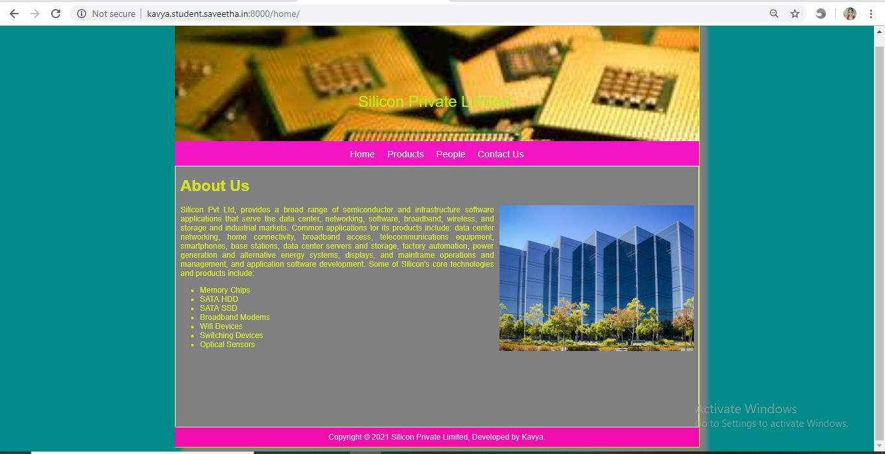
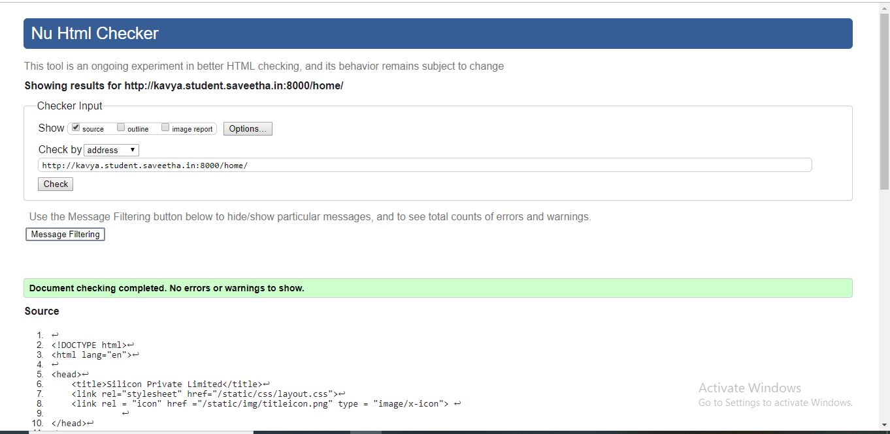
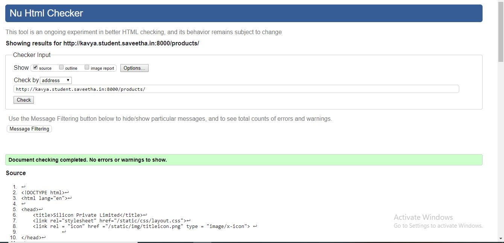
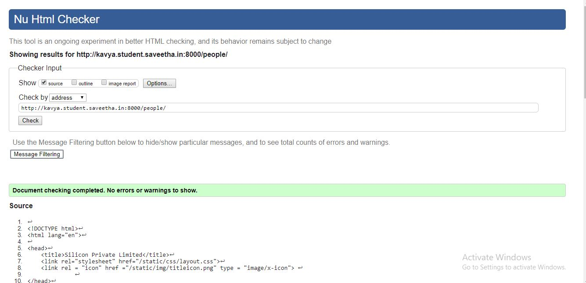
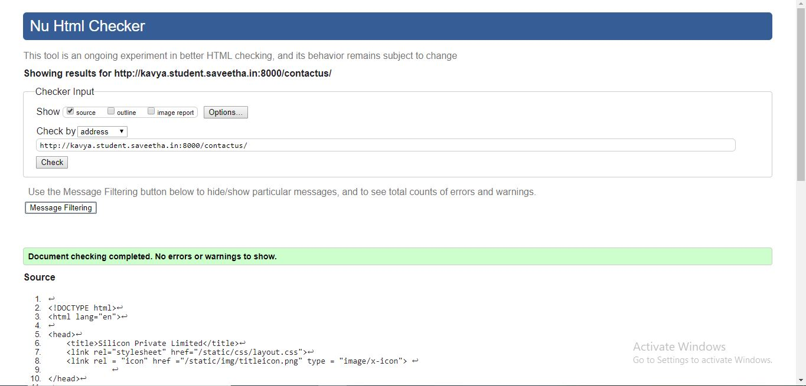

# Web Design for a Manufacturing Company
## AIM: 
To design a static website for a chip manufacturing company.

## DESIGN STEPS:
### Step 1: 
Requirement collection.
### Step 2:
Creating the layout using HTML and CSS.
### Step 3:
Updating the sample content.
### Step 4:
Choose the appropriate style and color scheme.
### Step 5:
Validate the layout in various browsers.
### Step 6:
Validate the HTML code.
### Step 6:
Publish the website in the given URL.

## PROGRAM:

### base.html
```

<!DOCTYPE html>
<html lang="en">

<head>
    <title>Silicon Private Limited</title>
    <link rel="stylesheet" href="">
    <link rel = "icon" href ="" type = "image/x-icon"> 
              
</head>

<body>
    <div class="container">
    <div class="banner">
        Silicon Private Limited.
    </div>
    <div class="menu">
        <div class="menuitem"><a href="/home">Home</a></div> 
        <div class="menuitem"><a href="/products">Products</a></div> 
        <div class="menuitem"><a href="/people">People</a></div>
        <div class="menuitem"><a href="/contactus">Contact Us</a></div> 
    </div><div class="content">
        
    
    </div>
    <div class="footer">
        Copyright © 2021 Silicon Private Limited, Developed by Kavya.
    </div>
    </div>
</body>

</html>
```

### home.html
```



    <div class="homecontent">    
    <h1>About Us</h1>
    
    <div class="contenttext">
    Silicon Pvt Ltd, provides a broad range of semiconductor and infrastructure software applications. Some of Silicon's core technologies and products include:
    <ul>
        <li>Memory Chips</li>
        <li>SATA HDD</li>
        <li>SATA SSD </li>
        <li>Broadband Modems</li>
        <li>Wifi Devices</li>
        <li>Switching Devices</li>
        <li>Optical Sensors</li>
    </ul> 
    </div>
    </div>

```
### products.html
```



    <div class="productcontent">    
    <h1>Our Premium Products</h1>
    <div class="productitems">
        <div class="productitem"> 
            <div class="itemimage">
            
            </div>
            <div class="itemname">4GB DDRA4 laptop memory</div>
            <div class="itemprice">Price: Rs.2000.00 </div>
        </div>
        <div class="productitem"> 
            <div class="itemimage">
            
            </div>
            <div class="itemname">1TB Laptop HDD</div>
            <div class="itemprice">Price: Rs.5000.00 </div>
        </div>
        <div class="productitem"> 
            <div class="itemimage">
            
            </div>
            <div class="itemname">Hard disk case</div>
            <div class="itemprice">Price: Rs.1800.00 </div>
        </div>
        <div class="productitem"> 
            <div class="itemimage">
            
            </div>
            <div class="itemname">Portable external hard disk</div>
            <div class="itemprice">Price: Rs.4000.00 </div>
        </div>
        <div class="productitem"> 
            <div class="itemimage">
            
            </div>
            <div class="itemname">Waterproof Portable external SSD</div>
            <div class="itemprice">Price: Rs.5000.00 </div>
        </div>
        <div class="productitem"> 
            <div class="itemimage">
            
            </div>
            <div class="itemname">Hard Drive Adapter</div>
            <div class="itemprice">Price: Rs.1000.00 </div>
        </div>
        <div class="productitem"> 
            <div class="itemimage">
            
            </div>
            <div class="itemname">Memory card for sd adapter</div>
            <div class="itemprice">Price: Rs.3500.00 </div>
        </div>
        <div class="productitem"> 
            <div class="itemimage">
            
            </div>
            <div class="itemname">Micro adapter</div>
            <div class="itemprice">Price: Rs.300.00 </div>
        </div>
        <div class="productitem"> 
            <div class="itemimage">
            
            </div>
            <div class="itemname">2TB HDD</div>
            <div class="itemprice">Price: Rs.5500.00 </div>
        </div>
        <div class="productitem"> 
            <div class="itemimage">
            
            </div>
            <div class="itemname">seagate expansion HDD</div>
            <div class="itemprice">Price: Rs.4300.00 </div>
        </div>
        <div class="productitem"> 
            <div class="itemimage">
            
            </div>
            <div class="itemname">Converter Adapter</div>
            <div class="itemprice">Price: Rs.1800.00 </div>
        </div>
        <div class="productitem"> 
            <div class="itemimage">
            
            </div>
            <div class="itemname">IDE Interface Network card</div>
            <div class="itemprice">Price: Rs.1500.00 </div>
        </div>
     </div>
    </div>

```
### people.html
```



    <div class="productcontent">    
    <h1>Our Premium Products</h1>
    <div class="productitems">
        <div class="productitem"> 
            <div class="itemimage">
            
            </div>
            <div class="itemname">4GB DDRA4 laptop memory</div>
            <div class="itemprice">Price: Rs.2000.00 </div>
        </div>
        <div class="productitem"> 
            <div class="itemimage">
            
            </div>
            <div class="itemname">1TB Laptop HDD</div>
            <div class="itemprice">Price: Rs.5000.00 </div>
        </div>
        <div class="productitem"> 
            <div class="itemimage">
            
            </div>
            <div class="itemname">Hard disk case</div>
            <div class="itemprice">Price: Rs.1800.00 </div>
        </div>
        <div class="productitem"> 
            <div class="itemimage">
            
            </div>
            <div class="itemname">Portable external hard disk</div>
            <div class="itemprice">Price: Rs.4000.00 </div>
        </div>
        <div class="productitem"> 
            <div class="itemimage">
            
            </div>
            <div class="itemname">Waterproof Portable external SSD</div>
            <div class="itemprice">Price: Rs.5000.00 </div>
        </div>
        <div class="productitem"> 
            <div class="itemimage">
            
            </div>
            <div class="itemname">Hard Drive Adapter</div>
            <div class="itemprice">Price: Rs.1000.00 </div>
        </div>
        <div class="productitem"> 
            <div class="itemimage">
            
            </div>
            <div class="itemname">Memory card for sd adapter</div>
            <div class="itemprice">Price: Rs.3500.00 </div>
        </div>
        <div class="productitem"> 
            <div class="itemimage">
            
            </div>
            <div class="itemname">Micro adapter</div>
            <div class="itemprice">Price: Rs.300.00 </div>
        </div>
        <div class="productitem"> 
            <div class="itemimage">
            
            </div>
            <div class="itemname">2TB HDD</div>
            <div class="itemprice">Price: Rs.5500.00 </div>
        </div>
        <div class="productitem"> 
            <div class="itemimage">
            
            </div>
            <div class="itemname">seagate expansion HDD</div>
            <div class="itemprice">Price: Rs.4300.00 </div>
        </div>
        <div class="productitem"> 
            <div class="itemimage">
            
            </div>
            <div class="itemname">Converter Adapter</div>
            <div class="itemprice">Price: Rs.1800.00 </div>
        </div>
        <div class="productitem"> 
            <div class="itemimage">
            
            </div>
            <div class="itemname">IDE Interface Network card</div>
            <div class="itemprice">Price: Rs.1500.00 </div>
        </div>
        
    </div>
    </div>

```
### contactus.html
```



<div class="contactuscontent">
    <h1>CONTACT US</h1>
    <div class="contactustext">
        <h2> Alekhya (General Contact Manager)</h2>
        <h2>KPR Silicon Products Private Limited</h2>
        <h2>KPR Silicon Products India Contact Information, Email Address, Main Office Locations including headquarters address, office phone number, customer support helpline number and email id is available here with company bio data, network presence, as well as service locations</h2>
        <h2>Telangana,India - 500081</h2>
        <h2>contact number - 9989674537</h2>
        <h2>Email address - Siliconcompany@gmail.com</h2>
    </div>
</div>

```
## OUTPUT:



## CODE VALIDATION REPORT:







## RESULT:
Thus a website is designed for the chip manufacturing company and is hosted in the URL http://demo2.student.saveetha.in:8000/. HTML code is validated.